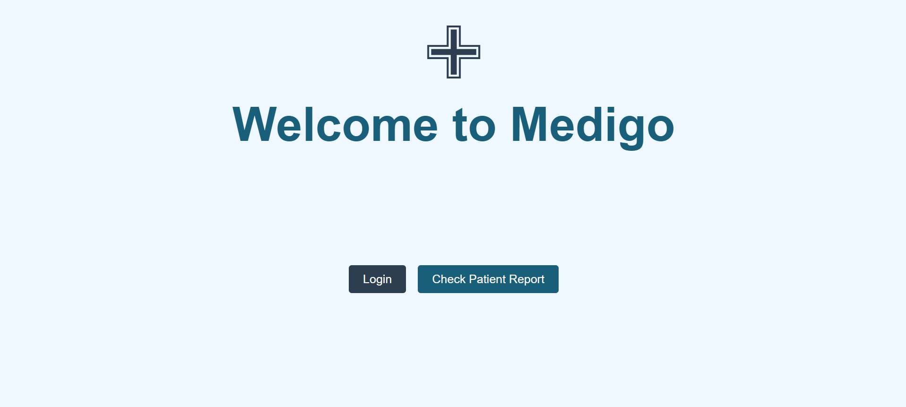

# MediGo - A Hospital Management System written in Go



## Requirements:

### 🚀 To build a Golang web application that consists of a receptionist portal & doctor portal which performs the following tasks:

- A single login page for both portals.
- Receptionists can register a new patient & perform CRUD operations.
- Doctors can view registered patient-related details and should be able to update the data.

## Deployment links

Frontend: https://medigo-frontend.vercel.app \
Backend: https://app-w0ew.onrender.com

## ✨Features

- 🔗 **Dependency Injection** for modularity
- ⌛ **API Versioning** for backward compatibility
- 💾 **Persistant storage** using PostgreSQL
- ⚡**Caching** - To reduce server load
- 🗐 **Pagination** - To efficiently handle and deliver large datasets
- 🚧 **Rate Limit** - To protect server resources
- 🔒 **JWT Authentication** for security

## 📦 Tech Stack

- **Backend** : Golang
- **Frontend** : HTML/CSS/JavaScript
- **Database** : PostgreSQL
- **Caching** : Redis
- **Deployment** : Vercel (Frontend) + Render (Backend)

## 👨‍🚀 Postman Collection

[Postman collection URL](https://www.postman.com/docking-module-cosmonaut-41943639/workspace/harshitraj-public-workspace/collection/40689865-dae91a9f-35fc-4337-9e23-1282d4a57dbe?action=share&creator=40689865)

## Video Demo

[Video Demo Link](https://riverside.fm/shared/exported-clip/97910da3b8c897d91dde)

## How to run this application locally

### 1. Prerequisites

Make sure you have the `Docker Desktop` installed on your system:

### 2. Clone the Repository

```bash
git https://github.com/harshitrajsinha/medi-go.git
cd medi-go
```

### 3. Set up environment variable

Create .env file in root directory

```bash
# For postgres docker image
POSTGRES_USER=postgres
POSTGRES_PASSWORD=yourstrongpassword
POSTGRES_DB=yourfavouritedbname

# Data storage
DB_USER=postgres
DB_NAME=yourfavouritedbname
DB_PASS=yourstrongpassword
DB_PORT=5432
DB_HOST=db

JWT_KEY = secretkeyword

REDIS_HOST=redis
REDIS_PORT=6379
```

### 4. Run the application

Run the following command in your bash terminal

```bash
docker-compose up --build
```
